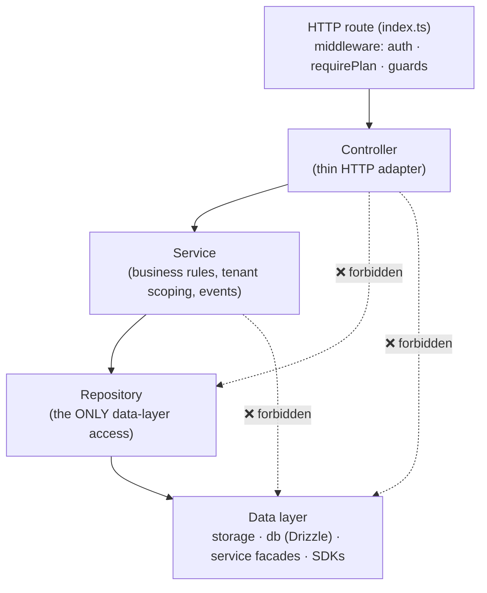
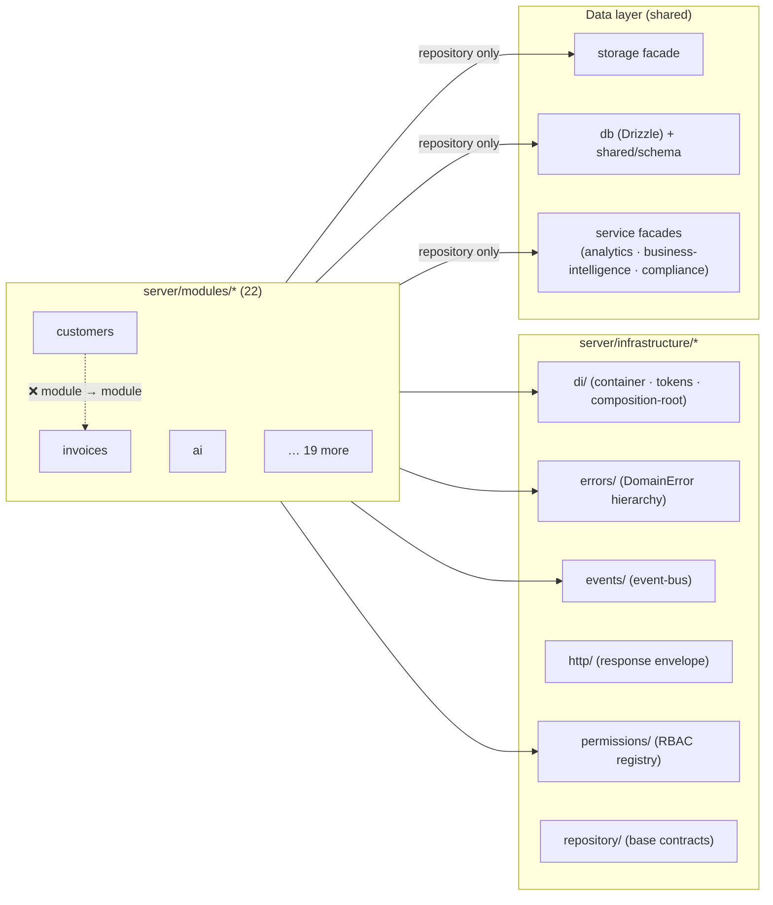
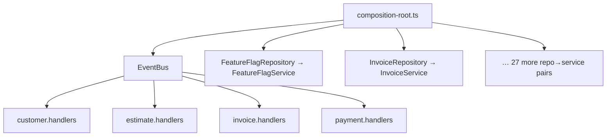
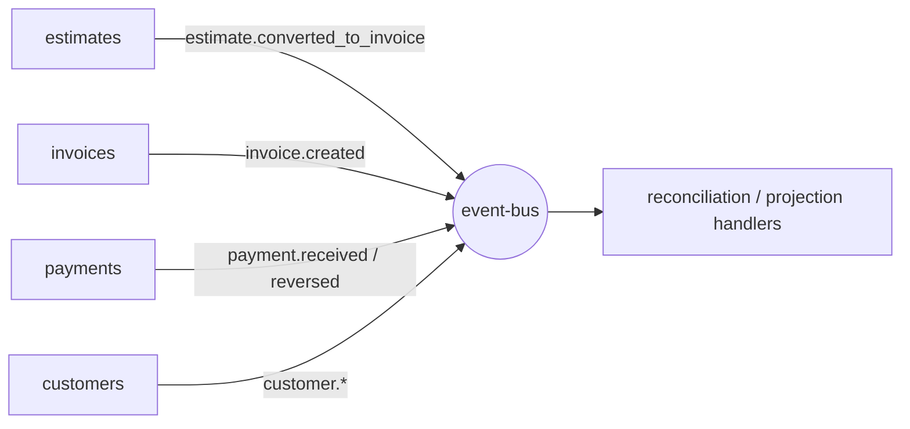

# Dependency Graph

How the modular architecture is allowed to depend on itself — and the
dependencies that are **forbidden** and enforced in CI by
`scripts/check-architecture.mjs` (`npm run lint:arch`).

## Layer dependency direction (within a module)

Dependencies flow one way. A layer may call the layer below it and nothing above.

**Rules enforced by `lint:arch`:**

1. Controllers must **not** import the data layer (`storage` / `db`) directly.
2. Services must **not** import the data layer directly — they go through a
   repository.
3. No module may import **another module's repository** (no cross-module data
   access). The composition root is the only external wiring point.

## Module ↔ infrastructure

Every domain module depends **inward** on shared infrastructure, never on another
domain module.

## Composition root — the one wiring point

The composition root is deliberately the **only** place that knows about
concrete classes from more than one module. It builds the event bus, then
registers each domain's repository and service.

## Event flow (in-process bus)

Write-path domains publish domain events; subscribers react without a compile-
time dependency on the publisher. Delivery is idempotent with retry/backoff and
dead-letter capture.

## Forbidden dependencies (summary)

| From | To | Verdict | Enforced by |
|------|----|---------|-------------|
| Controller | `storage` / `db` | ❌ | `lint:arch` rule 1 + ESLint `no-restricted-imports` |
| Service | `storage` / `db` | ❌ | `lint:arch` rule 2 |
| Module A | Module B's repository | ❌ | `lint:arch` rule 3 |
| Module | another Module | ❌ (communicate via events / composition root) | review + `lint:arch` |
| Repository | Controller / Service | ❌ (upward) | layering / review |

Current status: **0 violations** across `server/modules/**`.
