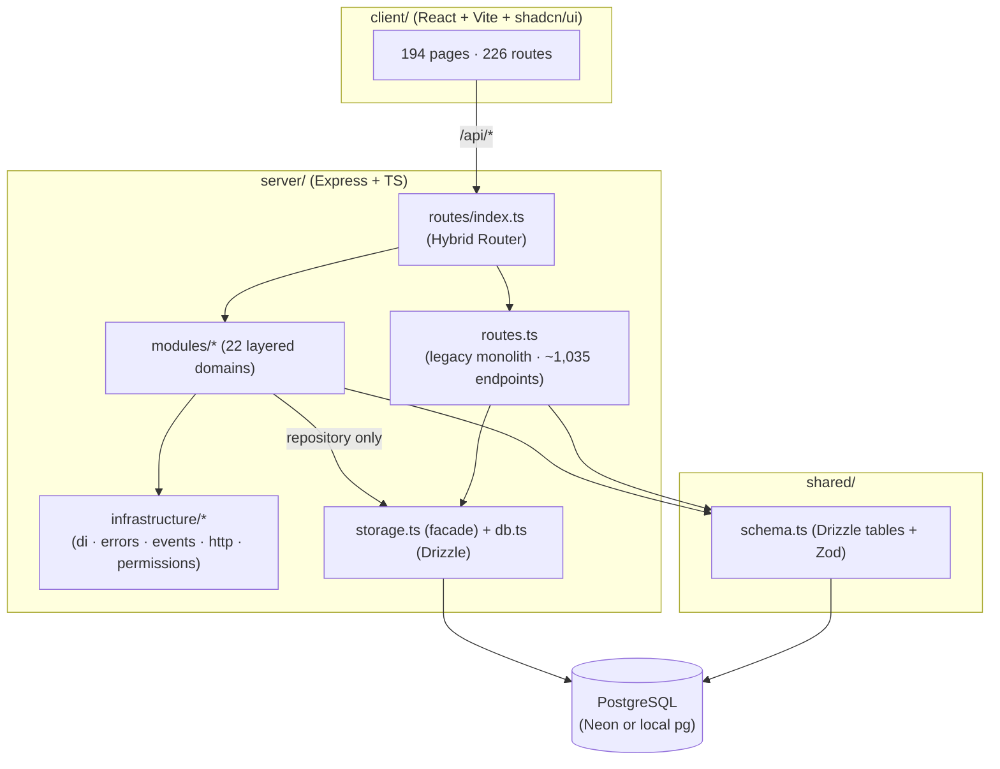
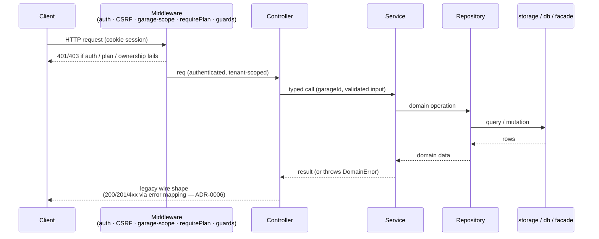

# System Architecture

SALIS-GMS is a multi-tenant garage-management platform: an Express + TypeScript
API over PostgreSQL (Drizzle ORM), a React/Vite client, and shared Zod/Drizzle
schemas. Phase E is evolving the backend from a partial modular monolith into a
**Domain-Driven Modular Monolith** (ADR-0001) via strangler-fig extraction
(ADR-0005).

## High-level topology



The **Hybrid Router** (`server/routes/index.ts`) is the seam between old and
new: it mounts the extracted domain modules *and* delegates the remainder to the
legacy monolith (`registerLegacyRoutes`). As domains migrate, mounts move from
the monolith side to the module side with no change visible to clients.

## Request lifecycle (a migrated endpoint)



## Folder structure

```
server/
  index.ts                     # entry (75 lines)
  routes/
    index.ts                   # Hybrid Router: mounts modules + legacy
    <feature>.ts               # legacy route files (shrinking set)
  routes.ts                    # legacy monolith (~20k lines, ~1,035 endpoints)
  storage.ts                   # legacy data-access facade (~15k lines)
  db.ts                        # Neon/pg conditional Drizzle driver
  infrastructure/
    di/                        # container · tokens · composition-root (ADR-0004)
    errors/                    # DomainError hierarchy (ADR-0002)
    events/                    # in-process event bus
    http/                      # response envelope + safe error mapping
    permissions/               # central RBAC registry + authorize guard
    repository/                # base repository contracts
  middleware/                  # auth, requireRole, requirePlan, garageScope, csrf
  modules/<domain>/            # 22 layered domains
    controllers/               # thin HTTP adapters (no rules, no data layer)
    services/                  # business rules, tenant scoping, events
    repositories/              # the ONLY data-layer access
    domain/                    # entity / domain types (where needed)
    validators/                # Zod schemas (where needed)
    events/                    # published contracts + handlers (write-path domains)
    __tests__/                 # DB-free unit tests
    index.ts                   # DI assembly → Express Router
shared/
  schema.ts                    # Drizzle tables + Zod (394+ tables)
client/
  src/pages/                   # 194 pages
  src/App.tsx                  # client routing
docs/
  adr/                         # Architecture Decision Records
  architecture/                # this pack + execution plan
scripts/
  check-architecture.mjs       # lint:arch governance
```

## Data flow & multi-tenancy

- **Tenant key:** every row is scoped by `garageId`. Middleware
  (`enforceGarageScopeOnQuery` / `enforceTenantOnBody`) and repository-level
  `where garageId = …` filters ensure a request never reads or writes another
  garage's data.
- **Auth:** Passport session cookies; `isAuthenticated` gate, `requireStaffByDefault`
  floor, role guards (`requireManagerOrAbove`, `requireRole([...])`), plan gates
  (`requirePlan('PRO'|'ENTERPRISE')`), and resource-ownership guards.
- **Persistence:** Drizzle over PostgreSQL; the driver auto-selects Neon (cloud)
  vs local `pg` by inspecting the `DATABASE_URL`. Schema changes go through
  Drizzle migrations in `migrations/`.
- **Events:** write-path domains publish domain events to the in-process bus;
  handlers (reconciliation, projections) subscribe without a compile-time
  dependency on the publisher.

## Cross-cutting infrastructure (adopted where it earns its place)

| Concern | Where | Adoption |
|---------|-------|----------|
| Dependency injection | `infrastructure/di` | All 22 modules |
| Structured errors | `infrastructure/errors` | All modules (mapped to legacy wire, ADR-0006) |
| Event bus | `infrastructure/events` | Write-path domains (customers, estimates, invoices, payments) |
| Response envelope | `infrastructure/http` | New/opt-in endpoints only |
| RBAC registry | `infrastructure/permissions` | Available; guards wired per-route |
| Caching (E11) / telemetry (E13) / CQRS (E6) | — | Deferred until a domain demonstrably needs them (see Technical Debt) |
