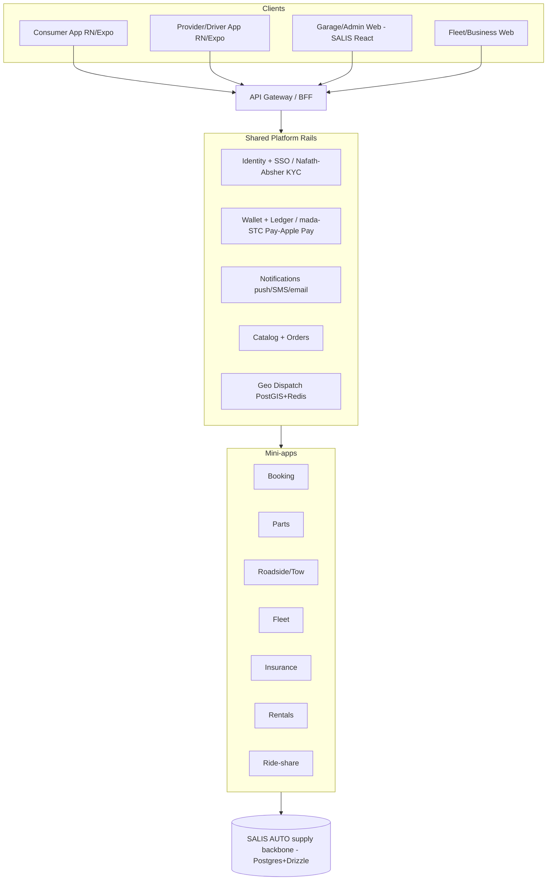

# 01 — Strategy & Architecture

## Concept

A super app = **3 shared rails + N mini-apps**, on top of SALIS as the supply backbone.

```
        ┌─────────── MINI-APPS (services) ───────────┐
        │ Booking  Roadside  Parts  Fleet  Insurance │
        │          Rentals   Ride-share  Inspection  │
        └──────────────────────────────────────────────┘
        ┌──────────── SHARED PLATFORM RAILS ───────────┐
        │ 1. Identity (one login)                      │
        │ 2. Wallet + Payments (one balance)           │
        │ 3. Orders / Notifications / Profile          │
        └──────────────────────────────────────────────┘
                SALIS AUTO = supply backbone
              (garages, workshops, inventory, staff)
```

**Principle:** every mini-app reuses Identity + Wallet + Notifications + Orders and adds only its
own domain logic. If a new service forces duplicating a rail, fix the rail instead.

## The 7 services → 3 waves

Order is driven by: (a) do we already have supply, (b) KSA regulatory weight, (c) rail readiness.

| Service | Supply needed | KSA regulator / integration | Difficulty | Wave |
|---|---|---|---|---|
| Garage service booking | Have (SALIS garages) | ZATCA Fatoora Ph2 | Low | 1 |
| Parts marketplace | Mostly (SALIS inventory) + suppliers | ZATCA, logistics | Low–Med | 1 |
| Periodic inspection (bonus) | Inspection centers | Fahes / MVPI | Low | 1 |
| Fleet management (B2B) | Existing business customers | Wasl (TGA), telematics | Medium | 2 |
| Roadside assistance / towing | New providers | TGA operating cards | Med–High | 2 |
| Insurance | Partner/broker | Insurance Authority, Najm, Tameeni | High | 3 |
| Car rentals | Fleet + partners | Tam e-contracts, deposits | High | 3 |
| Ride-share | Driver supply | TGA license, Saudization quota | Highest | 3 |

**Hard truth:** for roadside, insurance, rentals, and ride-share, the **license is the long pole, not the code.**
Treat ride-share as last or as a partnership.

## Target architecture (modular monolith first)



Extract the **dispatch engine** to its own deployable first — it is the only component with
Uber-scale real-time load. Everything else stays in the monolith until load justifies extraction.

## KSA regulatory & licensing map (start day one)

| Area | Body / system |
|---|---|
| Ride-hailing, towing, fleet operating cards | **TGA** (Transport General Authority) |
| Commercial fleet registration | **Wasl** |
| Insurance sale | **Insurance Authority**; claims via **Najm**; aggregator **Tameeni** |
| Payments / stored value (wallet) | **SAMA** — partner with a licensed PSP for stored value |
| E-invoicing | **ZATCA Fatoora** Phase 2 (integration) |
| Periodic vehicle inspection | **Fahes / MVPI** |
| Rental e-contracts | **Tam** (mandatory) |
| Identity / KYC | **Nafath**, **Absher**, **Yakeen** |
| Data protection | **PDPL** |
